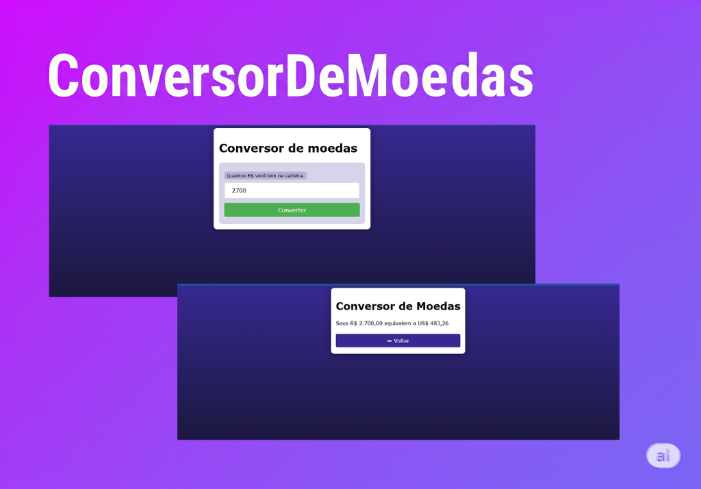

<h1 align="center"> Conversor de Moedas </h1>

Programa gratuito, promovido para ensino de tecnologias WEB.  
<a href="#"</a>

  <a href="#-tecnologias">Tecnologias</a>&nbsp;&nbsp;&nbsp;|&nbsp;&nbsp;&nbsp;
  <a href="#-projeto">Projeto</a>&nbsp;&nbsp;&nbsp;|&nbsp;&nbsp;&nbsp;

  

 

  

## 🚀 Tecnologias

Esse projeto foi desenvolvido com as seguintes tecnologias:

- HTML e CSS
- JavaScript
- Git e Github
- JSON

## 💻 Projeto

O Conversor de Moedas é um conversor de cotação que converte um valor em Reais para Dollar online.

- [Acesse o projeto finalizado, online](https://goncl.github.io/ConersoeDeMoedas/)
